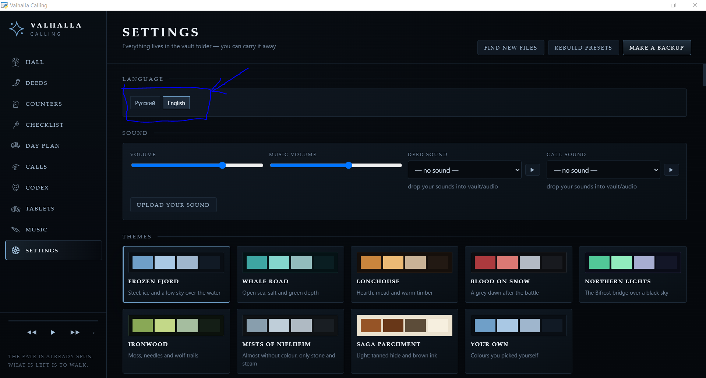
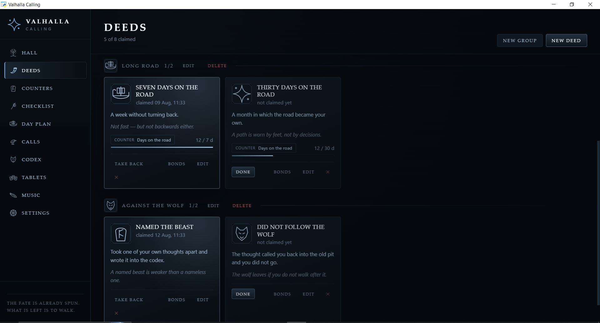
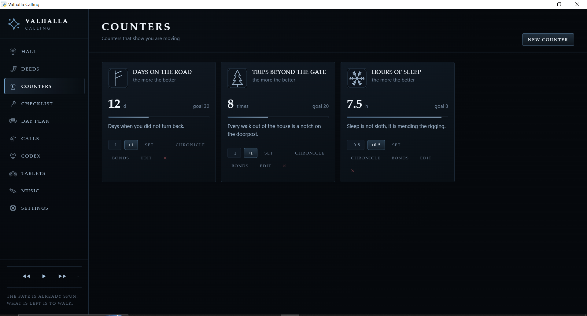
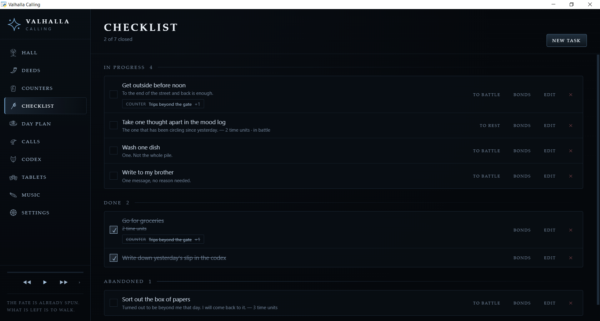
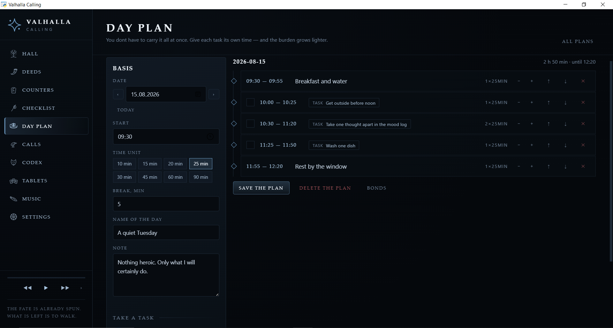
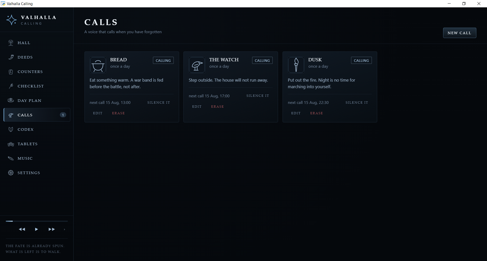
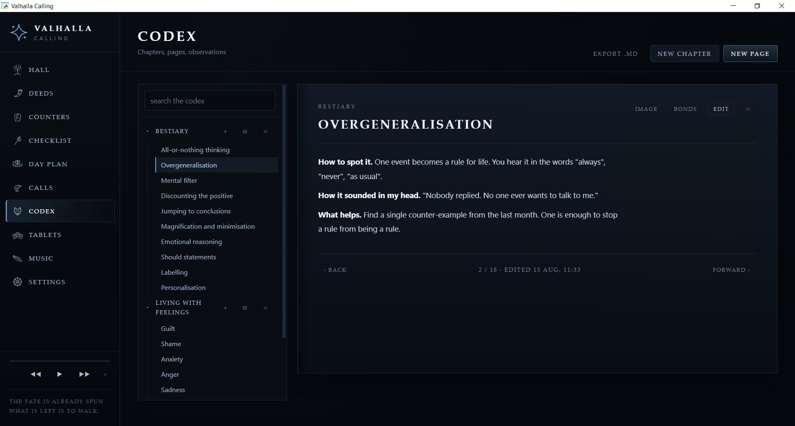
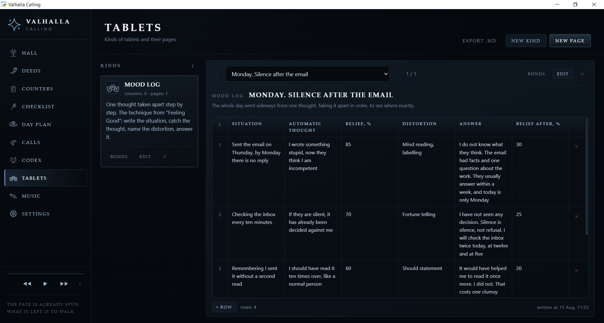
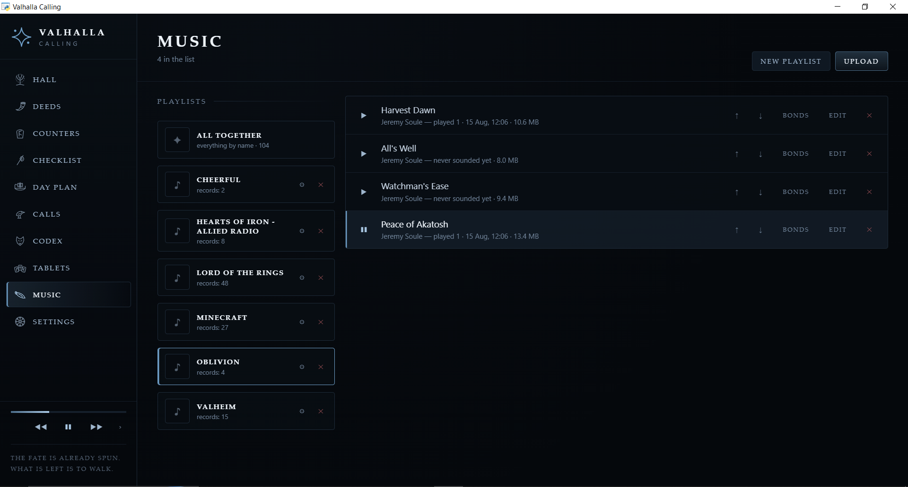

# Valhalla Calling

A local desktop app that turns climbing out of depression into a game. Deeds, metrics, a checklist,
a day plan, reminders, a codex of observations, tablets (tables for various cognitive therapy
techniques) and your own music — everything stays on your machine, no cloud and no accounts

[Русская версия](README.md)

## The app is free

### Features
To change the language open the settings and pick the language you want


#### Deeds
In the "Deeds" section you set goals for yourself, group them and take them.
A deed can be bound to a metric, and once the metric reaches the threshold the deed is granted automatically


#### Metrics
Metrics are a set of counters for tracking your progress. A metric can be bound to other things,
so you can move between them easily


#### Checklist
Just a checklist, so you do not have to keep everything in your head. The tasks written here can
then be laid out on the "Day plan" page. A task can be bound to other things, so you can move between them easily


#### Day plan
You pick the tasks, give each of them time across the day and mark what is done


#### Calls
Reminders — one-off or repeating. They announce themselves with a pop-up window
and a sound (either the default one or a sound of its own for each reminder)


#### Codex
A place for thoughts, observations and the main ideas from books — a set of notes, so you do not
keep it all in your head and can refresh it when needed. Can be exported to a markdown file


#### Tablets
A tool for working with tables — many cognitive therapy techniques mean working through your
feelings with methods that need a table. Can be exported to markdown files


#### Music
Just music for the mood — it can be grouped into playlists for convenience


#### Settings
When you add files to the vault folder by hand (music, background video, images and so on), press
"Find new files" for the changes to take effect


### Documentation
#### Running the app

All you need is [Python](https://www.python.org/downloads/) — version 3.12 or newer.

**Windows.** Open the project folder and run two files, one after the other:

```
scripts\setup.bat     the first time, installs everything needed
scripts\start.bat     every time, opens the app
```

**Linux and macOS.** In a terminal from the project folder:

```
chmod +x scripts/*.sh
./scripts/setup.sh
./scripts/start.sh
```

The first run takes a couple of minutes — libraries are installed and icons are drawn. After that only `start`.

#### Running with Docker (docker must already be installed)

This is the simplest way and the least prone to errors, because the whole environment is prepared already.
The difference is that the app runs in your browser.

Download the file
`docker/docker-compose.yml`, put it in any folder and from there:

```
docker compose up -d
```
Next to the docker-compose.yml file a vault folder will appear, where all the app data is kept.
Open http://localhost:8777. To stop it — `docker compose down`, the data stays.

#### Your vault folder

Everything you have made lives in the `vault` folder. Copy it to a flash drive, carry it to another
computer, put it next to the app — it will pick it all up.

| Folder | What is in it                                                                            |
| --- |------------------------------------------------------------------------------------------|
| `database` | your deeds, metrics, tasks, codex, tablets                                               |
| `images` | pictures: icons, covers, backgrounds                                                     |
| `audio` | sounds for reminders and deeds                                                           |
| `audio/playlist` | music, every folder inside is a playlist, the single picture in it is the playlist cover  |
| `video` | video for the window background                                                          |
| `fonts` | your own fonts                                                                           |
| `backups` | backups you made with the button in the settings                                         |
| `exports` | codex and tablets exported to markdown                                                   |

##### How to add your own files without opening the app

Just copy the files into the right folder. Then press **"Find new files"** in the settings — and they
will show up. The same thing happens by itself on every start.

It understands the usual formats: `png`, `jpg`, `webp`, `svg` for pictures, `mp3`, `wav`, `ogg`, `flac`,
`m4a` for sound, `mp4` and `webm` for video, `ttf`, `otf`, `woff2` for fonts. The name is taken from
the file name
