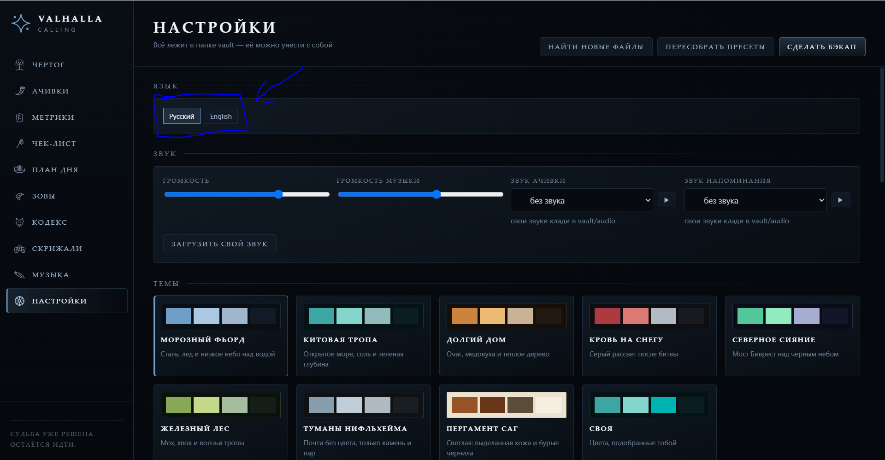
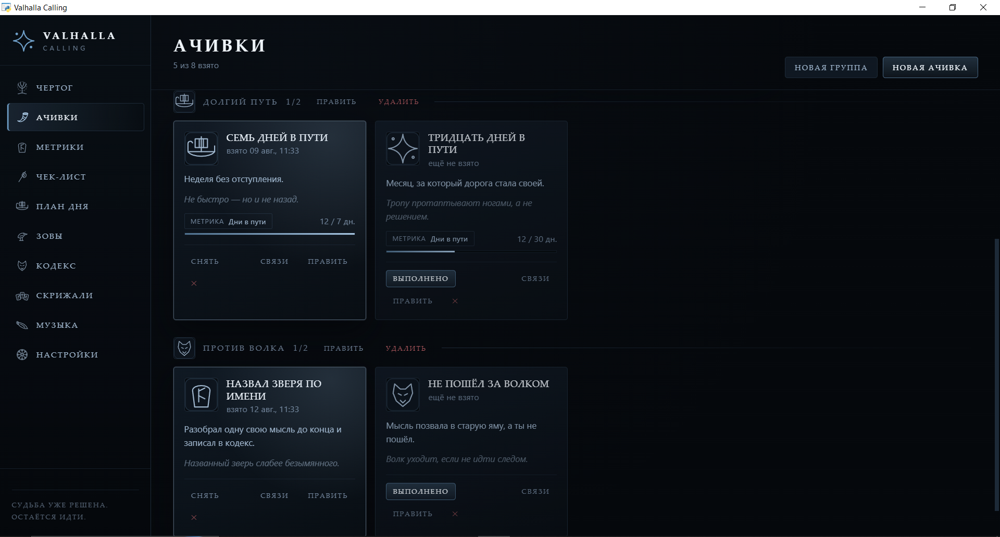
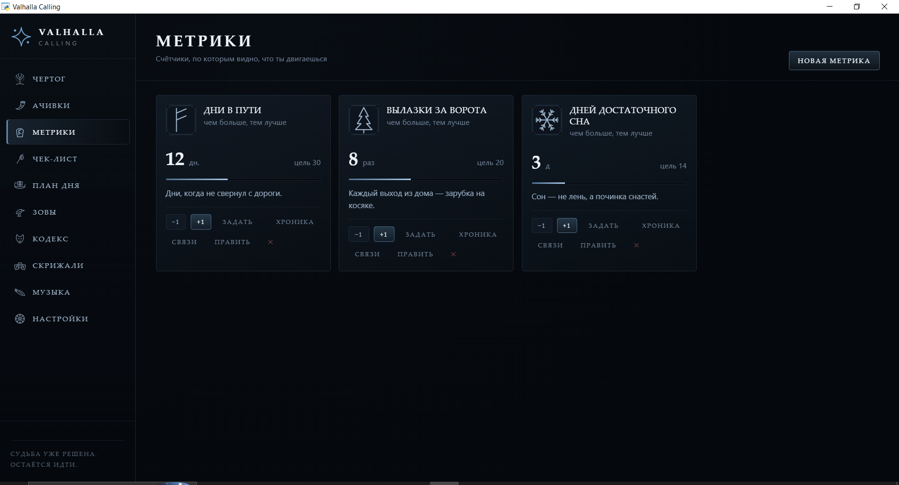
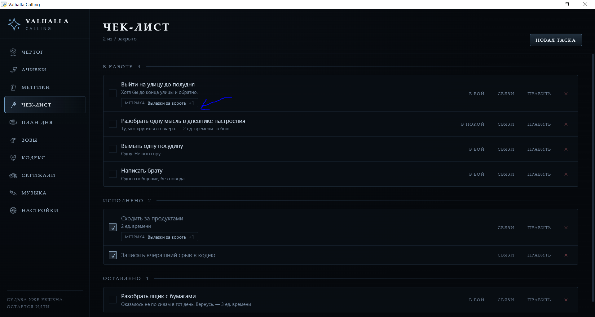
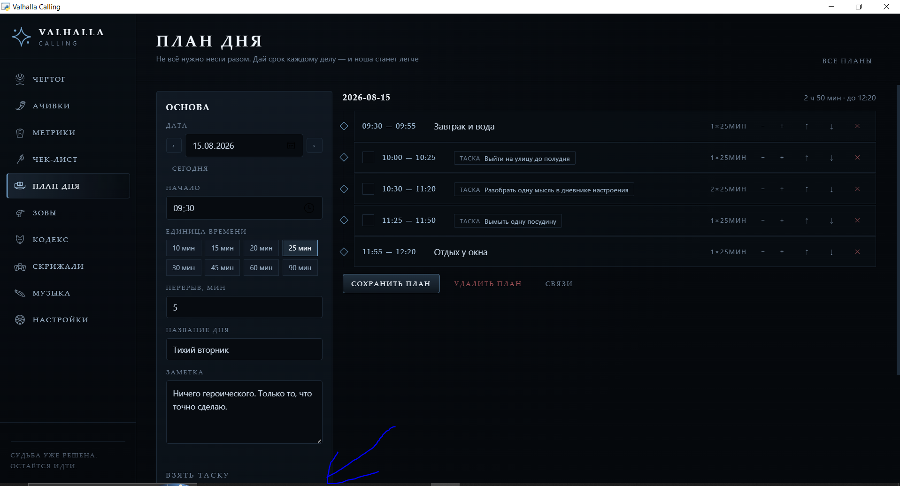
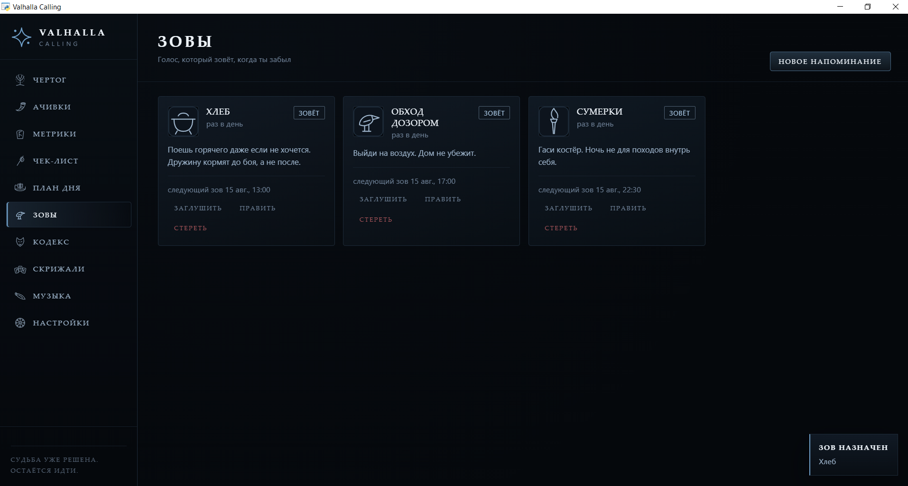
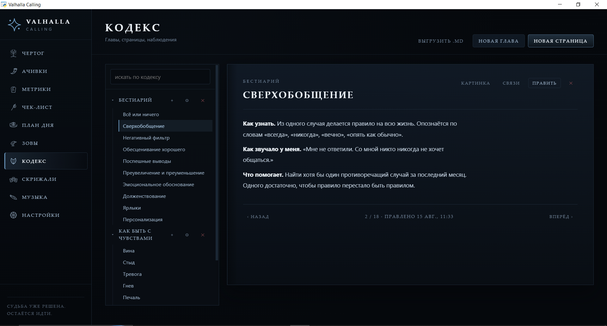
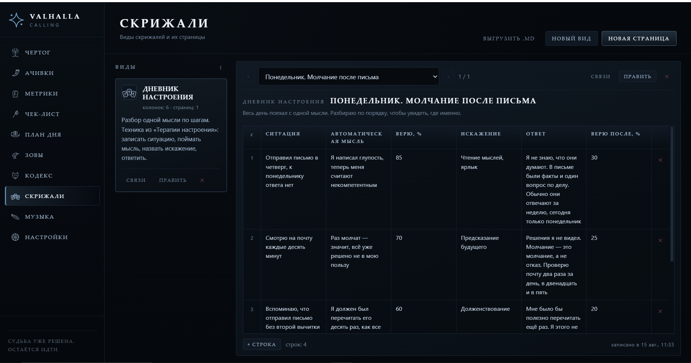
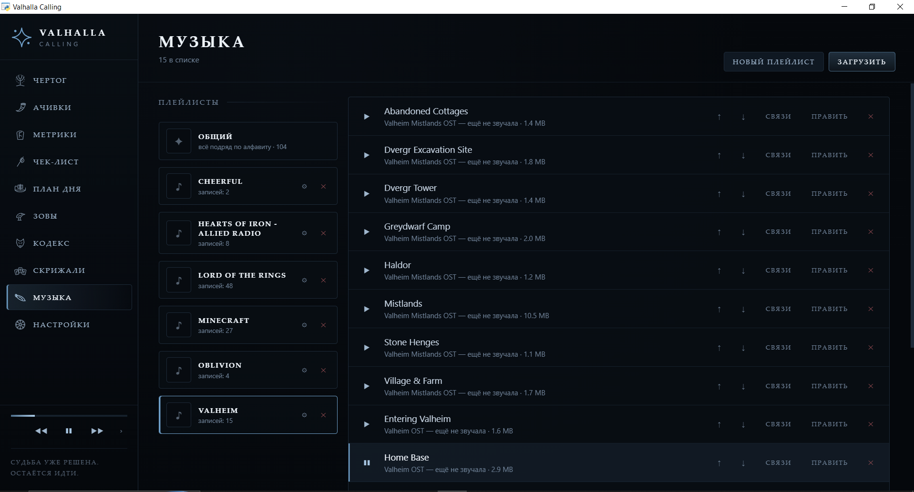
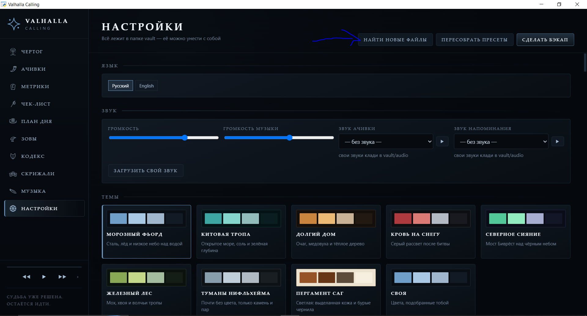

# Valhalla Calling

Локальное десктоп-приложение для геймификации выхода из депрессии. Ачивки, метрики, чек-лист,
план дня, напоминания, кодекс наблюдений, скрижали (таблицы для примения различных техник когнитивной терапии) 
и своя музыка — всё лежит на твоей машине, без облака и аккаунтов

[English version](README.en.md)

## Приложение бесплатное

### Возможности  
Чтобы изменить язык перейди в раздел настроек и выбери соответсвующий язык   


#### Ачивки  
В разделе "Ачивки" ты можешь выдавать себе цели, группировать их и достигать их.  
Ачивка может быть связана с метрикой и при достижении порога метрики ачивка будет выдана автоматически


#### Метрики  
Метрики это набор счетчиков для того, чтобы отслеживать свой прогресс. Метрика может быть связана с другими сущностями, 
для удобной навигации


#### Чек-лист  
Просто чек-лист для того, чтобы не держать все в голове. Потом описанные задачи можно упорядочивать на странице
"План дня". Задача может быть связана с другими сущностями, для удобной навигации



#### План дня  
Выбираешь различные задачи и выделяшь на них время по дням, отмечаешь выполнение   


#### Зовы  
Напоминания - могут быть как периодичными так и разовыми, напоминают звуковым сигналом и всплывающим окном о себе
и звуком (как звуком по умолчанию, так и на каждое напоминание свой звук)


#### Кодекс  
Место для записи мыслей, наблюдений, главных мыслей из книг, по сути конспект, чтобы не держать все в голове 
и при надобности освежать в памяти. Может быть экспортирован в markdown файл


#### Скрижали  
Инструмент для работы с таблицами - многие методики когнитивной терапии подразумевают под собой работу со своими
переживаниями с использованием различных техник для которых требуются таблицы. Могут быть экспортированы в
markdown файлы  


#### Музыка  
Просто музыка под настроение - может быть сгруппирована в плейлисты для удобства  


#### Настройки  
При добавлении файлов в папку vault вручную (чтобы не добавлять музыку, видео для фона, картинки итд) надо будет нажать кнопку
"Найти новые файлы" для того, чтобы изменения вступили бы в силу  



### Документация
#### Запуск

Нужен только [Python](https://www.python.org/downloads/) — версии 3.12 или новее.

**Windows.** Открой папку проекта и запусти два файла, один за другим:

```
scripts\setup.bat     первый раз, ставит всё нужное
scripts\start.bat     каждый раз, открывает приложение
```

**Linux и macOS.** В терминале из папки проекта:

```
chmod +x scripts/*.sh
./scripts/setup.sh
./scripts/start.sh
```

Первый запуск занимает пару минут — ставятся библиотеки и рисуются иконки. Дальше только `start`.

#### Запуск через Docker
Docker уже должен быть установлен  
Это самый простой способ и он в меньшей степени подвержен ошибкам, так как вся среда уже подготовлена.  
Отличие в том что, приложение будет работать в браузере.  

Скачай файл
`docker/docker-compose.yml`, положи в любую папку и оттуда:

```
docker compose up -d
```
Рядом с файлом docker-compose.yml появится папка vault где хранится вся информация приложения.  
Открывай http://localhost:8777. Закрыть — `docker compose down`, данные останутся.

#### Твоя папка vault

Всё, что ты завёл, лежит в папке `vault`. Скопируй на флешку, унеси на другой
компьютер, положи рядом с приложением — оно всё подхватит.

| Папка | Что в ней                                                                                |
| --- |------------------------------------------------------------------------------------------|
| `database` | твои ачивки, метрики, таски, кодекс, скрижали                                            |
| `images` | картинки: иконки, обложки, фоны                                                          |
| `audio` | звуки напоминаний и ачивок                                                               |
| `audio/playlist` | музыка, каждая папка внутри — плейлист, единственная картинка в папке — обложка плейлиста |
| `video` | видео для фона окна                                                                      |
| `fonts` | свои шрифты                                                                              |
| `backups` | бэкапы, которые ты сделал кнопкой в настройках                                           |
| `exports` | выгрузки кодекса и скрижалей в markdown                                                  |

##### Как добавить своё, не открывая приложение

Просто скопируй файлы в нужную папку. Потом в настройках нажми **«Найти новые файлы»** — и они
появятся. То же самое происходит само при каждом запуске.

Понимает обычные форматы: `png`, `jpg`, `webp`, `svg` для картинок, `mp3`, `wav`, `ogg`, `flac`,
`m4a` для звука, `mp4` и `webm` для видео, `ttf`, `otf`, `woff2` для шрифтов. Название берётся из
имени файла  


## Щит и копье наготове!
